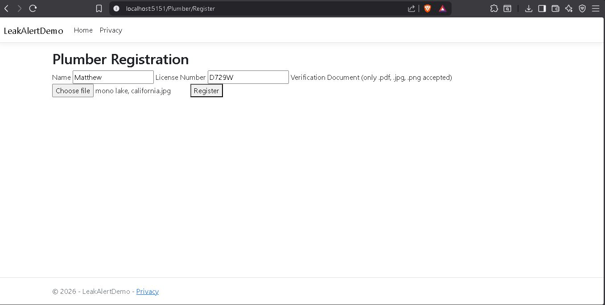
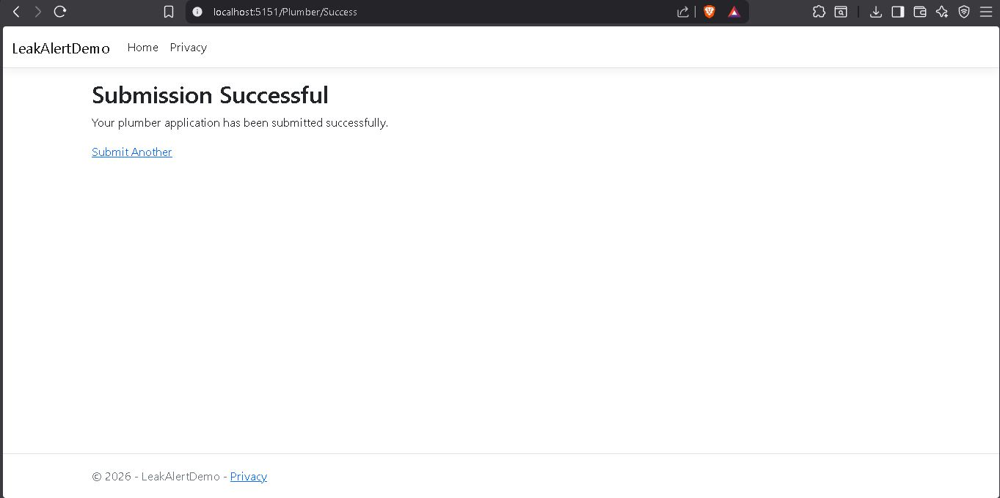
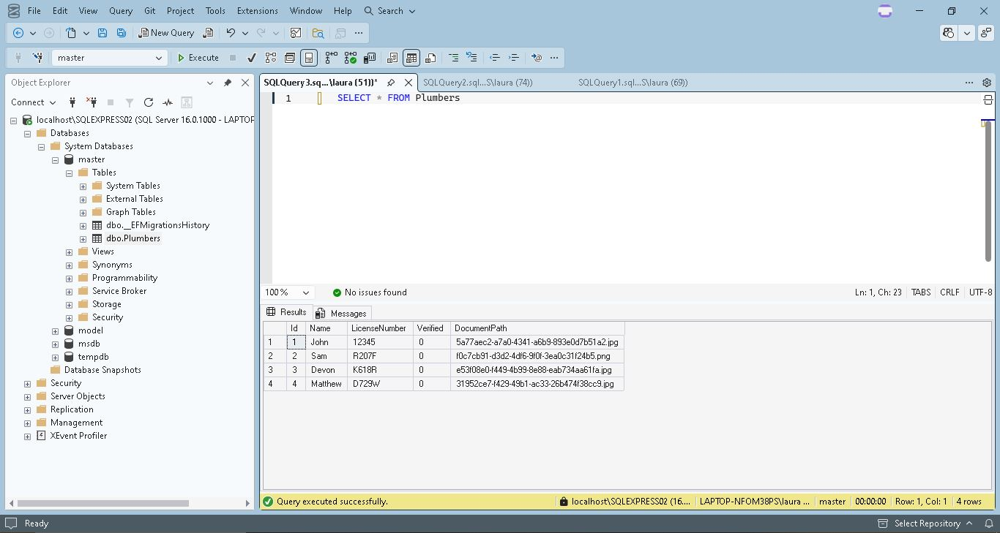

# Leak Alert Demo – ASP.NET MVC

This project simulates the plumber verification pipeline described in the Leak Alert platform job description.

The application demonstrates a secure contractor registration workflow built using ASP.NET MVC and SQL Server.

## Features

- ASP.NET MVC architecture
- Entity Framework Core database integration
- SQL Server backend
- Secure file upload validation
- Contractor verification workflow
- Security logging for suspicious uploads

## Architecture

Browser
→ ASP.NET MVC Controller
→ Entity Framework Core
→ SQL Server Database

## Security Measures

File Upload Validation
- extension whitelist (.pdf, .jpg, .png)
- max file size enforcement
- GUID file renaming
- uploads stored outside web root

SQL Injection Protection
- Entity Framework parameterized queries

Security Logging
- suspicious file uploads logged
- client IP recorded for investigation

## Technologies Used

- C#
- ASP.NET Core MVC
- Entity Framework Core
- SQL Server
- Git

## Screenshots

## Future Improvements

- Azure deployment
- authentication system
- automated verification pipeline
- admin dashboard